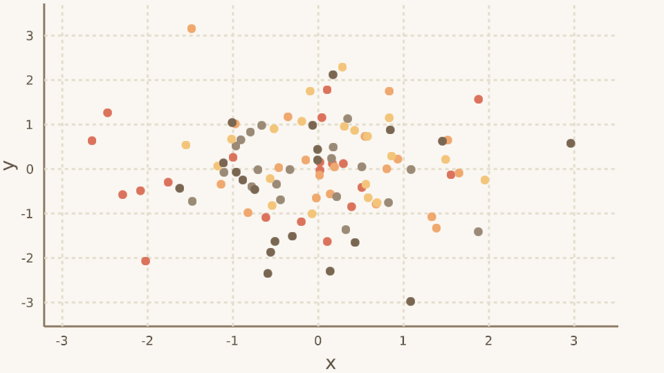
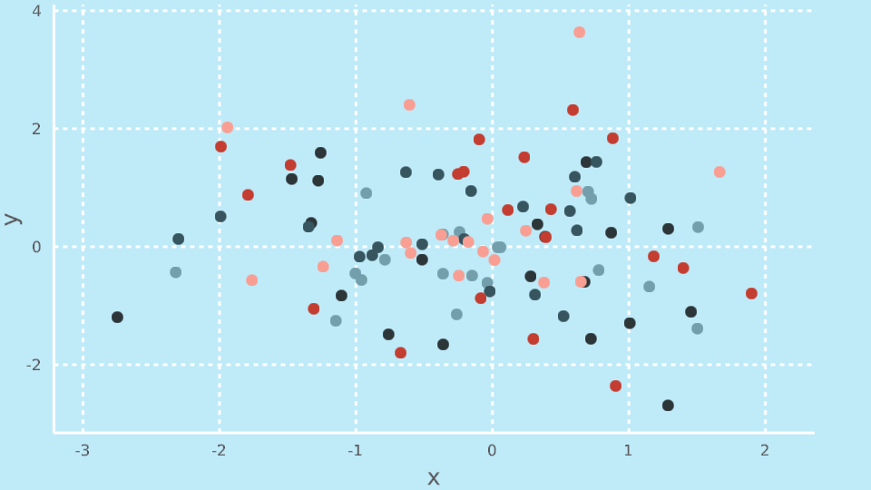
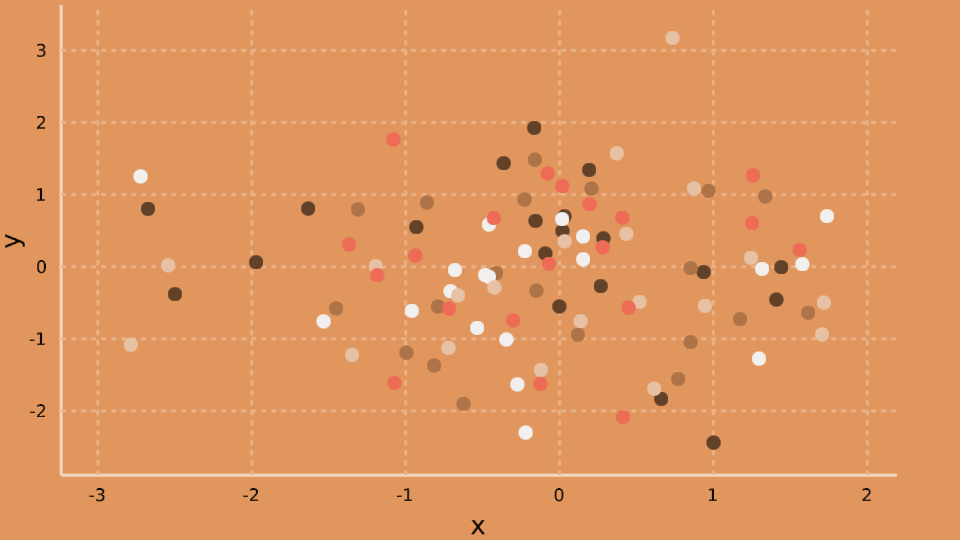
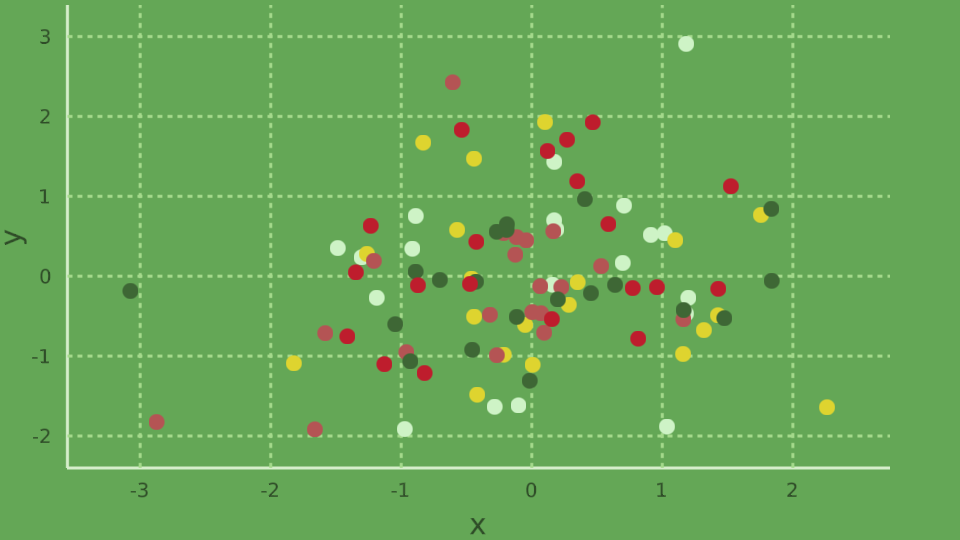

# MakieThemes

Very WIP

The idea of this package is to create a collection of themes for Makie to customize
the size and look of plot elements and colors. It will initially focus on porting
themes from existing plotting packages (hence the GPL-3 license).

Currently I've started work on a `GGThemr` library, that aims to emulate the themes
at https://github.com/cttobin/ggthemr

Here's the current default look of Makie on my machine:

```julia
using Makie
scene = scatter(randn(20), randn(20), markersize = 0.2)
scatter!(scene, randn(20), randn(20), markersize = 0.2)
scatter!(scene, randn(20), randn(20), markersize = 0.2)
scatter!(scene, randn(20), randn(20), markersize = 0.2)
scatter!(scene, randn(20), randn(20), markersize = 0.2)
```


Using the `:fresh` theme from `GGThemr`
```julia
using MakieThemes
show_ggthemr(:fresh)
```


This is the target theme I'm aiming for (image created with R)


Currently supported themes are:

### flat


### dust



### fresh


### carrot


### flat_dark


### sky



### copper



### light


### pale


### solarized


### sea


### chalk


### greyscale


### earth


### lilac


### grass



### grape


