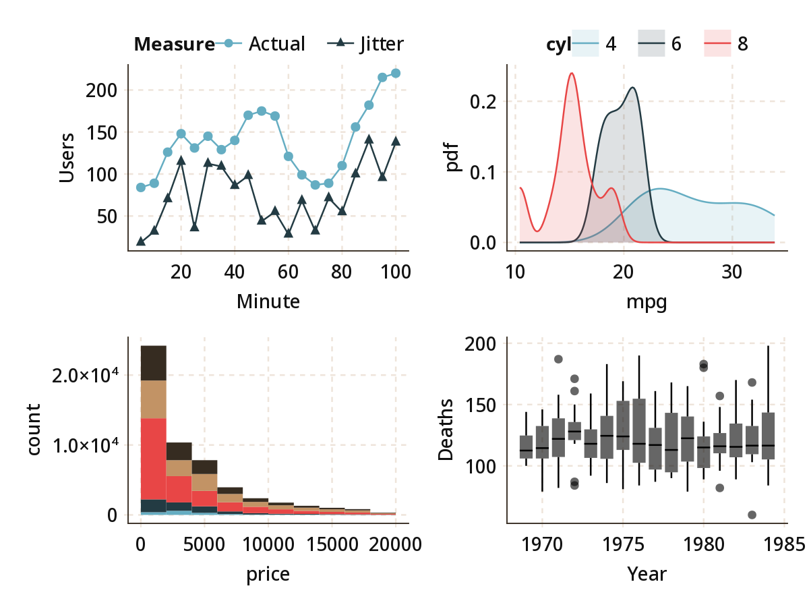

# MakieThemes

WIP

The idea of this package is to create a collection of themes for Makie to customize
the size and look of plot elements and colors. It will initially focus on porting
themes from existing plotting packages.

Currently I've started work on a `GGThemr` library, that aims to emulate the themes
at https://github.com/cttobin/ggthemr .

Here's the current default look of Makie on my machine:

```julia
using Makie
scene = scatter(randn(20), randn(20), markersize = 0.2)
scatter!(scene, randn(20), randn(20), markersize = 0.2)
scatter!(scene, randn(20), randn(20), markersize = 0.2)
scatter!(scene, randn(20), randn(20), markersize = 0.2)
scatter!(scene, randn(20), randn(20), markersize = 0.2)
```


Using the `:fresh` theme from `GGThemr`
```julia
using MakieThemes
show_ggthemr(:fresh)
```


Here's an expanded visualization based on the examples in the source theme:
```julia
import Pkg;
for dataset ∈ (:www, :drivers, :mtcars, :diamonds)
  @eval const $(dataset) = CSV.read(Pkg.dir(MakieThemes)*"/data/"*$(string(dataset))*".tsv", delim = '\t', allowmissing = :none)
end

AbstractPlotting.set_theme!(ggthemr(:fresh))

p1 = scatterlines(Data(www), :Minute, :Users,
  Group(color = :Measure, marker = :Measure),
  markersize = 6, marker = [:rect, :circle]);

p2 = plot(density, Data(mtcars),
  :mpg, Group(color = :cyl));

p3 = plot(Position.stack, histogram, Data(diamonds),
  :price, Group(color = :cut));

p4 = boxplot(Data(drivers), :Year, :Deaths);

vbox(hbox(p2, p1), hbox(p4, p3))
```


This is the target theme I'm aiming for (image created with R)


There are still issues such as
- font sizes vary, and the font is too bold
- alignments across subpanels
- axis line thickness
- the period of the dashed line
- overplotting of the axes by the dashed line
- the missing legends
- outliers and median marker for the boxplots
- reversed colors for the histogram
- colored fill area
- labelling of x and y axes
- implicit position of the 0,0 point within axes

Many of these should be addressed in StatsMakie or AbstractPlotting rather than here.

Currently supported theme libraries are:
- [ggthemr](ggthemr.md)
