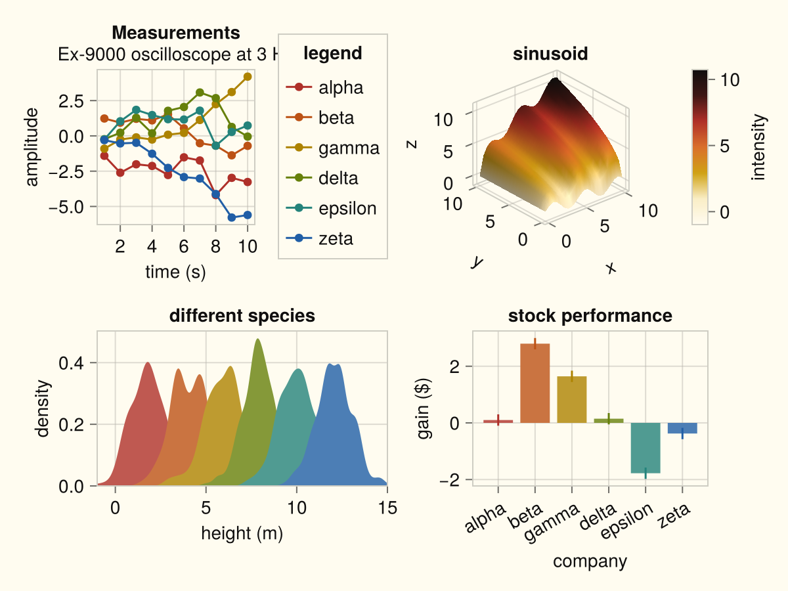
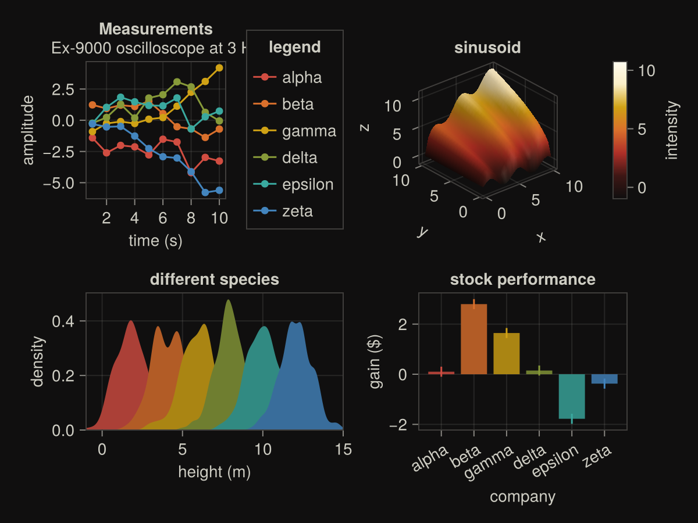

# Flexoki themes

[Flexoki](https://stephango.com/flexoki) color themes for Makie.

Color-only by design: these themes set colors (background, text, lines, palette,
colormap, 3D lighting, and the color of spines, ticks, grids, and frames) and
leave structural chrome — visibility, widths, paddings, fonts, tick sizes — to
whichever Makie style theme you choose.

## Intended use

These themes use the Flexoki UI palette. They are **not** scientifically
designed perceptual color schemes — they are not optimized for perceptual
uniformity, equal lightness steps, colorblind-safe sequential mapping, or
similar criteria in the [ColorSchemes.jl](https://github.com/JuliaGraphics/ColorSchemes.jl) / scientific visualization sense.

They are intended so figures can match a Flexoki-themed desktop, editor, or
terminal. They are **not recommended for publication figures** where a
purpose-built scientific colormap or palette is more appropriate.

## Usage

```julia
using Makie, MakieThemes

# Flexoki colors first — in Makie's merge the first theme wins — then the
# style theme supplies the remaining chrome
set_theme!(merge(color_flexoki(), theme_light()))
set_theme!(merge(color_flexoki(:dark), theme_dark()))

# theme_flexoki is an alias for color_flexoki
set_theme!(merge(theme_flexoki(:dark), theme_dark()))
```

## Light

`color_flexoki()` (default) / `color_flexoki(:light)` / `theme_flexoki()`:



## Dark

`color_flexoki(:dark)` / `theme_flexoki(:dark)`:



## API

- `color_flexoki()` / `color_flexoki(:light)` — light color-only theme (default)
- `color_flexoki(:dark)` — dark color-only theme
- `theme_flexoki(mode)` — alias for `color_flexoki(mode)`

## License

The Flexoki palette is copyright (c) 2023 Steph Ango and used under the MIT
license — see `LICENSE-Flexoki.md` (https://github.com/kepano/flexoki).
